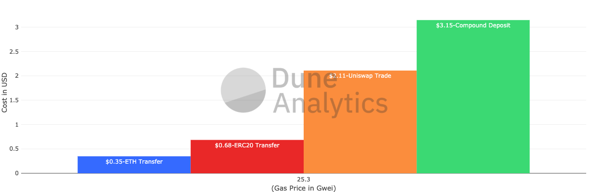
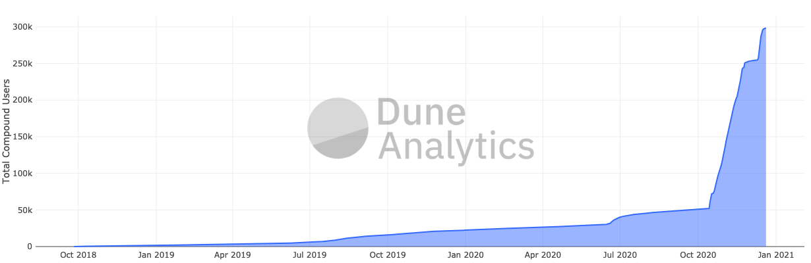
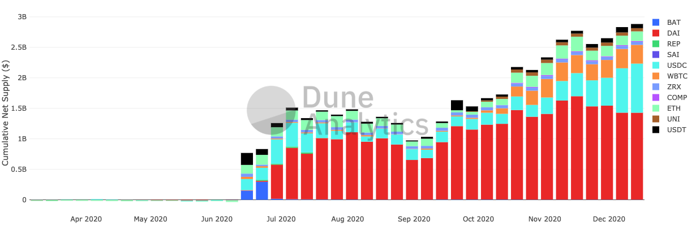
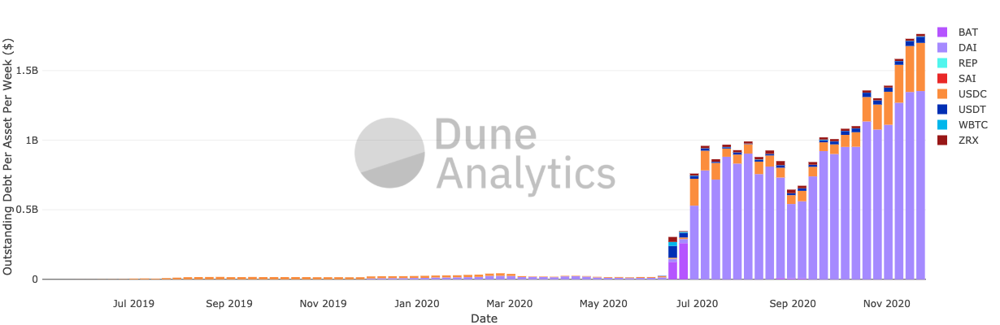
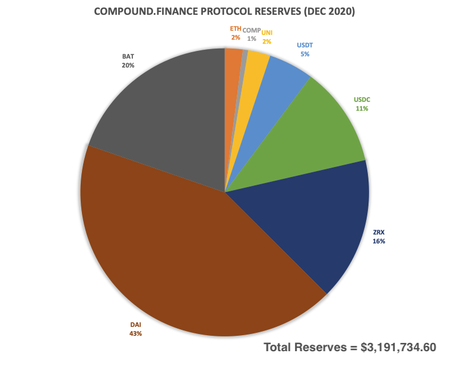
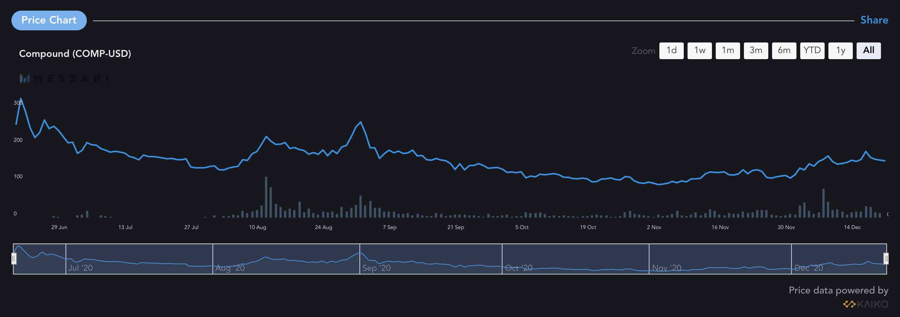

_Disclaimer: Everything stated here is speculation and opinion based on public information. Also, I own some COMP._

<blockquote class="twitter-tweet">
Today, we&#39;re excited to share the whitepaper for Compound Chain, a distributed ledger capable of transferring value &amp; liquidity between peer ledgers.<a href="https://t.co/TFjJ0JbToV">https://t.co/TFjJ0JbToV</a> <a href="https://t.co/lCzrGyscPa">pic.twitter.com/lCzrGyscPa</a>
&mdash; Compound Labs (@compoundfinance) <a href="https://twitter.com/compoundfinance/status/1339660221359124481?ref_src=twsrc%5Etfw">December 17, 2020</a></blockquote> 

Last week, [Compound.Finance](https://compound.finance) announced [Compound Chain](https://compound.cash), a new application-specific blockchain. This is an interesting announcement for any crypto-geeks like myself. I wanted to understand the strategy behind this move, so I'm going to attempt to break it down here. Skip to the bottom if you just want the takeaways.

# What is Compound.Finance?

At its highest level, Compound.Finance is peer-to-peer lending and borrowing. What's unique about Compound is that it's borrowing and lending managed fully on a distributed ledger (meaning less centralized control), with pooled liquidity to remove the UX friction associated with traditional peer-to-peer lending, and its interest rates are set programmatically based on supply and demand. It operates as a set of smart contracts on the Ethereum blockchain, along with a user interface located [here](https://app.compound.finance), and supports lending and borrowing of 9 different assets (as of Dec 2020). If this is the first time you've heard of Compound, you can start to learn more [here](https://compound.finance/documents/Compound.Whitepaper.pdf) and [here](https://medium.com/compound-finance/faq-1a2636713b69).

Compound has been one of my favorite Ethereum projects for quite some time. I was introduced to it by a colleague in December 2018, and it was one of the first decentralized applications I thought had an immediately apparent use case. When I was leading product at [Savvy](https://savvy.io) (a defunct non-custodial crypto-payment processor), we were on one of the first teams working on integrating Compound into our native crypto wallet.

# What is Compound Chain?

Compound Chain is a **newly announced blockchain** by the Compound team. Its objective is to become the unifying ledger that powers a future version of Compound.Finance spanning multiple blockchains (as opposed to the single Ethereum chain like today). It comes with a native unit of account called CASH to power transactions. It will have a built in Proof-of-Authority consensus mechanism, and will connect to supported blockchains through "Starports."

To supply an asset as collateral to the Compound Chain, users will lock assets native to the peer blockchain (i.e. USDC on Ethereum) in a Starport smart contract that exists on that peer chain, and the Compound Chain debits an equal amount of the corresponding asset to an account native to its chain. Users with a positive supply on the Compound Chain will then be able to borrow an asset of any supported type, no matter the chain, subject to collateral requirements set by Compound community governance.

# Does Compound need its own blockchain?

That's the question.

Many teams building smart contract applications don't have the resources or the competencies to build their own blockchains. In fact, the Ethereum blockchain was designed so that they didn't have to. But if a team did manage to get the resources, should they? It's been tried before with the Augur team. There's are a few reasons that project didn't see much in the way of success. The Compound team has plenty resources, and they're certainly competent.

Let's see if we can break some of the logic down.

## Reasoning from the Whitepaper

In regards to why, specifically, the Compound team states they're building Compound Chain, the team outlines a set of limitations in the new [whitepaper](https://compound.cash):

> _The protocol aggregates the risk of its supported assets; one bad asset spoils the bunch, limiting the universe of acceptable collateral._

True, but it would seem to me that that's a feature. Pooled liquidity across assets is one of the innovations that Compound brought to market, and at first glance it's still not quite clear to me how [Compound.Chain](http://compound.Cash) solves this limitation.

> _High transactions costs have priced out small transactions._

Indeed. As network congestion rises, gas fees have increased significantly, which increases barriers to entry. Who wants to spend $3 on gas to earn ~4-6% APY on $100 of USDC? A Proof-of-Authority chain would likely provide much cheaper and faster transactions, with less decentralization and censorship-resistance as tradeoffs.

**Typical transaction cost at current (Dec 2020) gas prices:**

> _The protocol has no way of supporting assets outside that aren't tokenized on Ethereum_

Technically, correct. But is there really much of a difference between wrapped Bitcoin and a Compound Starport version of BTC? Wrapped assets are a model that's already working. If you don't like a "centralized" wrapped asset model, you have renBTC and tBTC. Similar models for assets on upcoming chains will also likely be pioneered for Ethereum as long as DeFi remains primarily there (which I'll admit, isn't set in stone).

Ok, so just considering the limitations listed in the whitepaper, it's still not quite clear to me why the Compound team would decide to take on the herculean task of building its own blockchain.

## Layer 1 Point of View

It probably helps to also thinking about how Layer 1 (i.e. the blockchain layer) plays out in the future. The following are 3 camps that one might subscribe to:

1. _"There will be a winner-take-all blockchain in the long run, and it will be Ethereum."_
2. _"There will be a handful of chains that succeed, and we (or our community) has the ability to pick them."_
3. _"There will be many chains, and we don't want to try to pick winners."_

View #1 implies doubling-down on Ethereum by picking a Layer 2 scaling solution that's in the works (Optimistic vs zkSync) and expending resources to support. View #2 would mean re-building Compound on each individual chain that Compound (and its community) believes will be successful in the long run (Solana, Tezos, more listed in the Compound Chain whitepaper). View #3 would lead you down the path of considering that you may need to build your own chain and ensure interoperability between as many as possible.

**It seems clear to me that the Compound team subscribes to View #3.** The benefits to subscribing to this view means that the Compound team will take action to make sure Compound succeeds whether any single underlying blockchain also succeeds or not. The negative is the increased technical difficult and complexity of any solution proposed.

Thinking about Layer 1 this way, you could convince yourself to build a blockchain. You could also convince yourself that your product just needs to leverage one (or multiple) of the interoperability solutions (Polkadot, Cosmos) being worked on.

## Protocol KPIs and Desired Outcomes

So then, how does one decide between supporting an interoperability solution or building one yourself?

We might consider the outcomes that the team is trying to drive. KPIs that the Compound team is likely thinking about, in no particular order:

- Number of Unique Active Users
- Number of Assets Supported
- Protocol Revenue
- Governance Token (COMP) Value

These are my uninformed guesses on the high level KPIs that the Compound team cares about. In reality, they're probably looking at a specific form of these — I can't tell so I'll keep it relatively general. They may also be placing more weight on a subset of these, and they may be looking at other KPIs altogether. Let's take a deeper look at each anyway.

### Number of unique active users

More users means more potential activity in the form of supplying or borrowing. Unique active users is likely measured as unique addresses currently supplying the protocol with assets. Borrowers are inherently included in this because each borrower must also be supplying collateral.

This chart below shows the cumulative number of addresses that have supplied assets to the Compound protocol over time. We can see a (relatively) small bump when COMP launched over the summer of 2020, however, October was when significant increases in Compound users start occurring. A quick Twitter search finds that October 15 was when Coinbase Wallet began allowing COMP farming with USDC. Very interesting that a wallet integration was a much stronger catalyst for increasing the total number of users to Compound than the launch of COMP, which kickstarted the summer of yield farming (granted, that wallet is Coinbase).

**Total Compound Users Over Time**

Borrowers are the real valuable users. Everyone is interested in yield, but there's no yield if no one wants to borrow (and spoiler alert for below - today Compound only generates revenue on borrowing). Considering we don't see a similar October surge on the borrowing side in the chart below - the logical conclusion is that most of the Coinbase Wallet users are only supplying assets to the protocol. The launch of COMP and liquidity farming clearly had a clear impact on borrowing activity, that continues to remain elevated compared to before the launch.

**Compound Weekly Borrowers Over The Last Year**

Are there more borrowers on other chains that are just waiting for Compound to come to them? Likely not.

**Where are the active users today?**

Primarily BTC (Orange) and ETH (Blue). Other smart contract platforms like Tezos, EOS, and Cardano have not come close to those two since the end of 2019, and the disparity is growing. Compound already has access to the majority of crypto users by just existing on Ethereum. Expanding to new blockchains doesn't seem like it's going to make much of an impact at today's levels of active address activity. This could always change in the future though.

### Number of assets supported

Increasing supported assets increases the total potential value that can be locked in Compound.

Expanding beyond a single chain certainly expands the pool of assets to choose from to build new markets. Building markets around new assets has two clear benefits:

1. The health of the network has less dependency on any one asset.
2. The serviceable addressable market increases (i.e. the total possible value that can be supplied into Compound).

Again, there is current a model for this - wrapping assets on the parent blockchain and issuing ERC-20 versions of them on Ethereum. I'd accept the argument that wrapped assets aren't really viable long term, however, as it provides no benefit for the parent chain. If anything, wrapped assets are a net negative for the parent chain because it locks those assets up and decreases parent network activity potential in exchange for activity on Ethereum.

There are teams working on interoperability though (Polkadot, Cosmos), in a way that doesn't require an application to build its own blockchain and interoperability solution in one. To decide to ignore these, you would have to either 1) not have much faith in their ability to execute on a solution that works for your application within a reasonable time frame, or 2) have a strong desire not to be tied to them.

### Protocol revenue

The Compound protocol makes revenue by capturing a portion of interest generated from borrowing activity. More borrowing = more protocol revenue. To enable borrowing, there must be supply. So net supply and outstanding debt are two of the metrics to explore here.

Based on the data below, supply is definitely growing - \$3B in supply as of mid-Dec 2020 - kicked off by the June 2020 COMP launch.

**Compound Cumulative Net Supply (\$)**

Outstanding borrows are also growing along with supply - \$1.5B as of mid-Dec 2020.

**Compound Outstanding Debt Per Asset Per Week (\$)**

Is outstanding debt likely to increase by supporting other chains? There will be desire to borrow assets of other chains, so probably. It would seem that Compound has yet to extract as much as possible from Ethereum though (ETH's market cap alone is ~\$70B), and this still doesn't explain why the team wouldn't let someone else do the heavy interoperabilty lifting.

**Protocol Revenue To Date (Dec 2020)**

If you're curious, here's a breakdown of Compound protocol revenue. Compound has amassed \$3m in revenue (= reserves) to date:

### Governance token (COMP) value

**COMP Price History as of Dec 2020 (\$)**

COMP being the native value capture asset, it makes sense that maximizing the value of COMP is the ultimate objective, similar to how maximizing stock price is the ultimate objective for any publicly listed company.

So, how would expanding chain support increase COMP value? Increasing assets supported likely has a future positive impact on protocol revenue, which in turn positively impacts COMPs long-term price.

Expanding our view a bit further to consider this in the context of handling interoperability themselves, increasing the scope of what COMP governs is likely to increase COMP's value in the long run because it removes the ability of a third-party to capture any of that value as transaction fees.

# Risks

So what are the risks to a smart contract application implementing a purpose-built blockchain? **It comes down to getting four things right:** technical implementation, token economics, governance, and community (which is kinda tied to governance, but distinct enough to break out on its own IMO).

Depending on how much the team bootstraps technical implementation, it could be the hardest out of the four to get right. Primitives like encryption and signatures, consensus algorithm, block structure, networking, state, and client support. Hyperledger Fabric was built for application-specific blockchains like this, but my guess is that the team will use something that's a bit more closely tied to the Web3 ecosystem, like Parity Substrate. A framework like Substrate contains a lot of core blockchain components that can be bootstrapped, and the team will build whatever else they see as missing.

The Compound team has significant experience with economics and governance, so I'm guessing they'll be alright there. They'll have no problem finding assistance with designing any sort of token economics that they don't have experience with, and then can lean on a governance mechanism like the one they already have in place today to fix anything that's not quite right once they go live.

Community is what's unknown for me. Compound's been tied to Ethereum since its inception, and has been able to take advantage of the strong developer and investor community that's grown around it. Will the community they've built follow them to a new chain? Will Compound even need the community to follow with them? It's not clear, and likely depends on how composable it is and how incentivizes are designed. At the very least, governance requires active participants, so they'll need some subset of users to care. That being said, today's governance feels accessible only to those early parties that the team distributed tokens to during the launch of COMP (their VCs, Dharma, etc.), so maybe that's all they'll need to go along with them, and those parties will be motivated to actively participate in governance and draw users along, to maximize the value of their COMP holdings. Whether the rest of the DeFi ecosystem will care is still up in the air.

---

# Takeaways

- Compound is creating an application specific blockchain.
- The Compound team likely believes that there will be many successful chains in the long run, and they don't want to pick a winner.
- Compound Chain allows for increased borrowing activity derived from expanded asset support, and drives as much value capture to COMP as possible.
- Technical risk, economics, governance, and community all need to come together smoothly in order for the project to be successful.

Did I get something wrong? [Send me a message.](mailto:mtthew.p.hamilton@protonmail.com)
