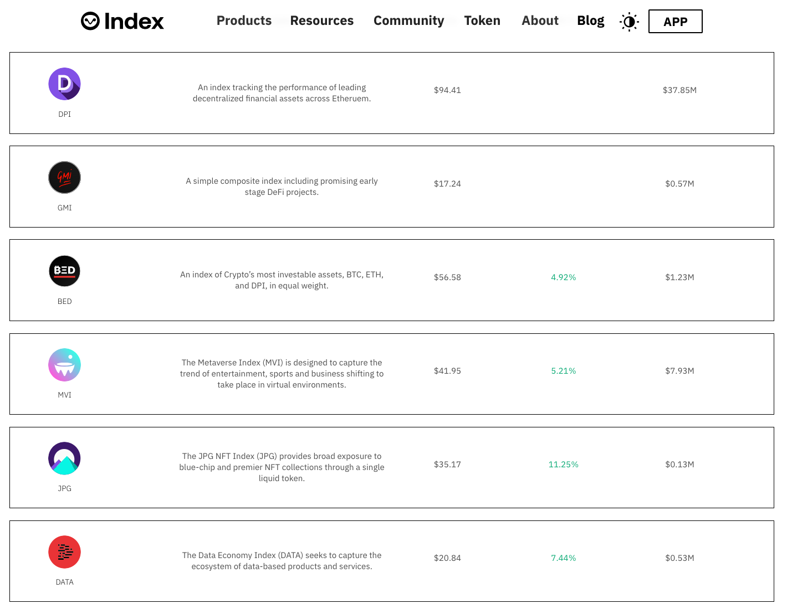

Today, most passive retail investors invest their funds via exchange-traded products like mutual funds or ETFs via their brokerage account. These ETPs package assets together into themes that enable investment into multiple assets with a single purchase. Building on top of ETPs, robo-advisors enable passive investors to take a portfolio-focused approach to investing with a minimal set of investment decisions.

The concept I want to discuss today answers the question “What would an on-chain robo-advisor offering look like for crypto?”

## What is a robo-advisor?

I’m guessing anyone reading this knows what a robo-advisor is, but to level set, a robo-advisor is an investment platform that provides individual investors with financial investment opportunities in an automated, passive fashion with little to no human intervention. Robo-advisors started surfacing in the 2010s and became popular in the later half of the decade. [Betterment](https://www.betterment.com/) and [Wealthfront](https://www.wealthfront.com/) are the leading US robo-advisor brands. Traditional brokerages, like [Schwab](https://intelligent.schwab.com/) and [Fidelity](https://www.fidelity.com/managed-accounts/fidelity-go/overview), have also created their own robo-advisor offerings to compete for this market segment.

They’re stupidly simple to use, typically accessible via a mobile app for convenient access, and cheaper than traditional financial advisors — 1% vs. closer to 0.25%. However, they don’t tend to handhold clients through decision-making that goes into the portfolio strategy recommendations, nor through times of market volatility. They also can’t provide one-off advice like whether or not one should exercise stock options, or be operating their investments via a pass through entity like an LLC.

Robo-advisor customers are financially sophisticated enough to know that they should be investing for their future, but don’t have the time or the desire to manage their financial portfolios on their own and prefer to have someone (or something, e.g. a computer) else manage it for them. Common demographics of customers tend to skew younger — millenial or gen z — with less than $250k to invest. Younger demographics are likely to be digitally native and more comfortable with the concept of an algorithm managing their funds than older ones. Less wealthy as well because personal financial advisors tend to serve clients with more than $250k.

### What does a Robo-Advisor actually do?

Robo-Advisors can be broken down into three functions:

1. Investor Profile & Risk Assessment
2. Investment Recommendations
3. Portfolio Management

**Investor Profile & Risk Assessment**

The first thing that a robo-advisor will do is build a profile about the investor by asking them about things like their demographics, goals, risk tolerances, investment horizon, net worth, sources of funds, etc. which is then used to determine the investor’s expectation of return and the level of risk they’re willing to take.

**Investment Recommendations**

With the investor’s preferences defined, the robo-advisor then uses the data as inputs to make investment recommendations from a menu of investment options that it has available. This personalized portfolio typically includes a mix of asset classes, like equities, bonds, cash in the form of ETFs.

**Portfolio Management**

Once the customer confirms the portfolio and makes their initial investment, the robo-advisor manages the customer’s portfolio over time. Management can include portfolio rebalancing and tax-loss harvesting. Rebalancing involves periodically buying and selling assets so that the client’s portfolio mix matches the investor’s target allocations. Tax-loss harvesting involves selling portfolio assets that are depressed in value to offset any capital gains tax due on other profitable sales of assets.

## Current Landscape

There are a few “crypto” robo-advisors out there. Both Betterment and Wealthfront have stakes in the game already. [Wealthfront enables crypto exposure via Grayscale’s GBTC and ETHE](https://support.wealthfront.com/hc/en-us/articles/4403721436948-Cryptocurrency-at-Wealthfront). Investors simply add them to their portfolios like they would any ETF. Unfortunately, these products are quite expensive with a 2% annual management fee. This model also doesn’t allow customers the ability to take possession of the underlying crypto assets as the Grayscale products don’t allow for that. As of July 2022, both these products are currently trading at a discount, meaning that if the SEC ever allows for an ETF conversion with a redemption feature, investors could see a significant returns (that is unlikely to happen soon).

Betterment recently [bought a start-up called Makara](https://www.prnewswire.com/news-releases/betterment-enters-the-cryptocurrency-market-by-acquiring-makara-301477162.html), which offers crypto baskets for users to invest in. Unlike Wealthfront’s offering, Makara allows customers to withdraw their funds in crypto, specifically BTC and ETH, but doesn’t support the robo-advisor functionality outside of its app infrastructure. Once a user withdraws on chain, they are self-custodying their own funds and managing their own portfolio.

Another couple options for passive crypto investors are Domain Money and Titan. These offerings are not actually “robo-advisors” in the sense that their portfolio strategies are actively managed, not passively, but they tend to compete for the same investor type — one looking to delegate away the management of their crypto investing.

---

## What value might an on-chain robo-advisor provide?

Before diving into any sort of solution, I think its helpful to outline what benefits an on-chain robo-advisor might be. I’d propose there are at least four benefits to an on-chain robo-advisor:

1. Self-custody
2. Global access
3. Lower fees
4. Expanded investment options

**Self-custody**

Robo-advisors today require the use of a custodian. For many, a custodian is the right option and self-custody is not. However, with a custodian comes control over what can can be done with your assets. Self-custody removes that control and places it back into the hands of the investor.

**Global access**

Robo-advisors are bound by geographic restrictions. If you want to use Betterment as a Thai citizen, you cannot. Similarly, if I wanted to use Siam Commercial Bank’s service as a US citizen, I cannot. My choices are limited by the services that support my passport. With an on-chain service, all I need is an internet connection and enough ETH to pay gas fees.

**Lower Fees**

While Robo-Advisors tend to charge lower fees than traditional financial advisors, they still charge ~0.25% annually on top of the individual investment fees. An on-chain service with decentralized with used-owned governance could be less profit seeking than a corporation and therefore charge less fees than centralized counterparts.

**Expanded investment options**

Admittedly, this one is a bit aspiration right now, primarily because it’s not trivial to access the same investment options on-chain today as are offered by services like Betterment and Wealthfront, e.g. a Vanguard Large-Cap ETF. Securities regulations aside, I can see a world where synthetic versions of traditional investment opportunities become available on-chain. Consider that on-chain synths could be constructed for any investment opportunity across the globe, investment options would expand considerably. Not to mention the access to the crypto-native assets which are not offered as options by regular robo-advisors.

---

## The On-Chain Robo-Advisor

The On-Chain Robo-Advisor system would have the following:

1. **Advisor** - Constructs, deploys, and manages a portfolio strategy
2. **Investment Provider** - Constructs, deploys and manages the ETF-like indices that compose the robo-advisor portfolio strategy
3. **Investor** - Supplies capital to the Advisor’s strategy

The necessary primitives for this are already in place. [Set Protocol](https://www.setprotocol.com/) is a platform for creating and managing portfolios of ERC-20 tokens. Using Set, developers can create indices that represent a basket of assets that track specific portfolio allocations. On top of this, there are already a few creators of Set indices, namely [Index Coop](https://indexcoop.com/) and its participants, which has created various baskets of assets spanning sectors of crypto like DeFi, Web3, and infrastructure.

Index Coop’s indicies are great instruments for getting exposure to multiple crypto assets with a single purchase. They span a wide range of sectors, including DeFi, Web3, NFTs, and infrastructure, so that one could theoretically manage their hole portfolio using only these indices. The problem is that the user still required to build their own portfolio, determine allocations, and monitor the market for rebalance opportunities.

An Advisor would create a portfolio strategy targeting a specific investor risk profile using existing investment options available from Investment Providers. The Advisor could be able to configure the investment options included in the strategy, the target portfolio allocations of each asset, rebalance frequencies and/or allocation triggers, and fees. The advisor strategy could be deployed as pooled portfolio strategy, where many investors leverage single contract to manage their portfolios. The strategy could also be deployed in a direct indexing format, where a custom portfolio strategy is deployed for each individual investor, a la the separately managed account structure of many robo-advisors today.

The Investor would choose an Advisor portfolio strategy based on a matching risk profile and preference of investment options included in the strategy. To enter the portfolio strategy in the case of a pooled investment strategy, the Investor could either mint new Advisor portfolio strategy LP tokens, or purchase LP tokens on the secondary market. Such pool could support depositing of USDC or another single asset, which would then be routed to a DEX to exchange deposited funds into the Investment Product’s tokens (e.g. DPI). Or could support conversion of the supplied asset to the underlying assets, which can then be used to mint more tokens from the Investment Provider (e.g. Uni, Aave, Maker, etc.). As for how an investor could interact with the Advisor, the advisor could build a UI for the investor to interact with, or a third-party could insert themselves within the stack here.

That’s all for now!
